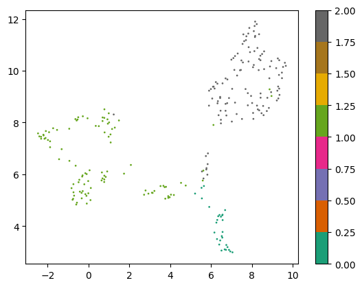

# contamination-detector

DL camera contamination detector

# Описание решения

## EDA

### Результы анализа данных 

С помощью кластерации исходных данных удалось выделить 3 хорошо разделенных кластера существенно различающихся между собой изображений. (см подробности в файле cluster_images.ipynb) 

Поэтому была обучена модель кластерации, позволяющая быстро определить принадлежность изображения к тому или иному кластеру. Для каждого кластера можно обучить отдельный детектор и выбирать его в режиме реального времени при обработке изображений.

### Описание файлов

Каталог cluster содержит эксперименты по кластеризации изображений и их масок

1. cluster_images.ipynb -- код кластеризации изображений
2. cluster_masks.ipynb -- код кластеризации масок
3. image_similarity.py -- вспомогательный код построения эмбеддингов на основе resnet

## Решение

Решение представляет собой композицию 2х моделей: кластеризация + детекция загрязний.

1. На этапе кластерации происходит построение эмбеддига текущего изображения и его классификация с помощью обученной модели кластеризации.
2. В зависимости от номера кластера применяется подходящая модель детектора.

### Описание файлов

Каталог solution содержит код визулизации работы алгоритма и пайплан использования композиции моделей. 

1. plot_images.ipynb -- скрипт визуализации результатов работы модели
2. solution_pipline.ipynb -- пример работы композиции моделей

### Models

Каталог weights содержит обученные веса для модели yolo11n и модель кластеризации kmeans. 